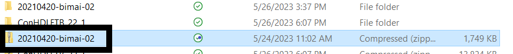

# General Notes

Here is the [link](https://www.cadence.com/en_US/home/training/all-courses/86097.html) to the course.

* Follow the same steps as above for starting this project; however, **DO NOT** download the lab database into OneDrive (or any form of online storage), as this may cause problems later in the course

* I actually enrolled in the 22.1 version of the course but used the 17.4 version of the software, and I did not encounter any issues. Currently, we are using the 17.4 version of the software due to the 22.1 version not being fully licensed for Clemson students yet. 

* When the lab PDF tells you to save the project, and an error comes up when you do this, first check if the lab PDF says anything about errors coming up. If it does, you are good to move on. If it does not, click on the error to see if you can fix it before moving on.

* A mouse is highly recommended for this course. Aside from general ease of use with circuit design, the 3D step models require scroll wheel function.

# Requirements

* Access to PCB Editor 17.4

* Access to Project Manager 17.4

* Access to Padstack Editor 17.4

## Module 1 and Database Downloads

Module 1 of the course simply contains an overview of what the course will cover. It is still important to read over this and gather an understanding of what you will be learning. Before starting the course you should head to the **Database Downloads** module of the course. On the Module 1 page, click "Database Downloads" and save the folder "Lab Database" to a location on your computer. I recommend making this folder easy to access as you will be navigating to it a lot throughout the course. Right-click on this folder, and click "Extract all". Also, open up the "Lab PDF" in a new tab. See below.

## Module 2

For this module, once you open the PCB Editor, choose the product "Allegro PCB Venture," as this is the one we have access to due to the licensing. Other than that, this module is fairly straightforward.

## Module 3

It is recommended to make sure that you have the **Find, Options, Visibility, and Command** windows open. To do this, go to view, windows, and click each of these options until they have a blue checkmark next to them. In lab 3-2, at part 7, when you press the **Tab** key, you should see the U3 device attach to your pointer like this (seen below).

## Module 4

In this module, you learn about the PCB Editor Initialization. Using the different ways to set up the user interface, you change the font sizes, change windows, and learn how to assign tasks to certain keys with the editor command window. Lots of visual diagrams are provided to assist you in following the labs.

## Module 5

This module is fairly basic, as the guide describes the steps in detail. You create the PAD STACKS for the PCB.

## Module 6

In this module, you learn all about package symbols. In lab 6-1, you will setup your first 16-pin DIP with package symbol wizard. Shown below (on the left) is what it should look like after you finish the lab. 

Shown below (on the right) should be the final result of creating the SOIC 16. 

For all of the labs using the 3D canvas, just make sure all of the contact points look lined up once you have finished following the directions in the lab. 

## Module 7

In this module, you learn how to create the outline of a board. 

In part 7-1, you will need to add chamfers to your design, and at one point, you will need to add the dimension for the angle and length of the chamfer (which we found to be a bit tricky). Make sure you select Dimension/Drafting > Dimension Environment before you right click otherwise, the chamfer leader option will not be present. 

## Module 8

First, when you go to the Project Manager application, use the "Allegro PCB Designer Suite" product instead of what the lab book tells you to use, as "Allegro PCB Designer (Layout)" is not an option due to our licensing. The main important part of this module is making sure you do the correct part of the module corresponding to what you've done earlier in the course. Also, when using the System Capture Application, pick any product to see what works. (Try to pick one that has a similar name to that given in the lab book).

## Module 9

For this module you will learn how to edit specific properties for pins and nets along with set constraints. There are no major tips or guides for this section as the instructions are very clear and with the knowledge up to this point you have everything you need to complete it. 

## Module 10

In module 10, you work on placing components and all the details that go along with them. During lab 10-2, you will incrementally reference the RefDes of the devices on the board. The first device you need to change is the J* in the bottom left, which should become J1. During this lab, you will begin placing parts, specifically U1, 2, 3, and 4. While placing these, you will see a bunch of light blue lines in the picture, and it can get quite messy. These are rat's nests or unconnected pins, which you will learn more about when you route connections. The red and green "A" looking icons allow you to turn on and off the rat's nest. This will just make your board easier to look at without all the lines.

The rest of the lab is fairly straightforward, but the hard part will come with a lot of practicing with the moving, rotating, and deleting components. You will be given at many points reference pictures for how your board should look at certain points. I highly recommend taking the time and moving these components to the places you see in the most effective and fastest ways possible. That means rotating at user-picked points and using ctrl-click on the components you want to move.

Below is an example of what your board might look like at the end of the lab.

## Module 11

Module 11 is super  quick and really easy to follow. There is not much to go over this and it is very self-explanatory. 

## Module 12

Module 12 is where we can learn about routing which is how we actually connect the pins on the board to other components. There are many options for doing this with a variety of settings for how we organize the board to be as clear and realistic as possible. Shown below is how the GND and VCC planes should look after completing 12-4.

## Module 13

For this module, you will need the 17.4 versions of the application. As stated before, this is due to licensing issues. If you only have the 22.1 version downloaded, go to the getting started page of this website and follow the directions to download the 17.4 version.

## Module 14 & 15

We did not find any big issues with this section of the course. Just follow the directions very closely, and you should be fine.

As a general tip for the course, if you feel you don't really remember parts of the course or have a bunch of errors in your files, it may be beneficial to go back through certain sections of the course to help you remember how to use the software correctly, and this will likely help you on the badge exam as well.