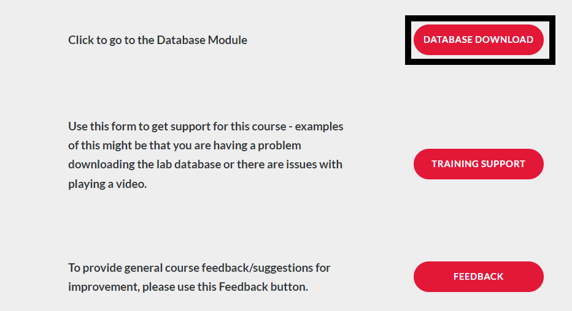
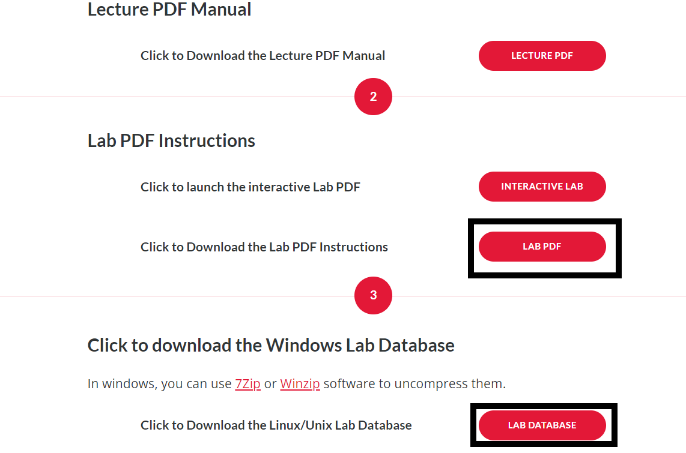

# General Notes

* Here is the [link](https://www.cadence.com/en_US/home/training/all-courses/86271.html) to the course.

* Follow the same steps as above for starting this project; however, **DO NOT** download the lab database into OneDrive (or any form of online storage), as this caused problems down the line for me archiving the project, etc. 

* When the lab PDF tells you to save the project, and an error comes up when you do this, first check if the lab PDF says anything about errors coming up. If it does, you are good to move on. If it does not, click on the error to see if you can fix it before moving on.

# Requirements

* Access to Capture CIS 17.4

* Access to PCB Editor 17.4

* Also helpful to have finished the courses before this one on the learning map.

# Resources

* Website to learn about package types as they are once again mentioned in this lab

# Introduction

This course covers bringing a design over from the OrCAD Capture schematic editor to the PCB Editor. This will cover many aspects of the design process and in particular the use of the constraint manager to set parameters for the PCB layout. Please note that at the moment Cadence only offers the 17.4 version of this course, but you can follow along using the 22.1 Capture software just fine. However you will need access to both the 22.1 and 17.4 PCB Editor if you choose to use the 22.1 Capture software. This guide will cover some of the differences between the 22.1 and 17.4 software as they show up in the course. (Recommended to just use the 17.4 software)

## Module 1 and Database Downloads

Module 1 of the course simply contains an overview of what the course will cover. It is still important to read over this and gather an understanding of what you will be learning. Before starting the course you should head to the **Database Downloads** module of the course. On the Module 1 page, click "Database Downloads" and save the folder "Lab Database" to a location on your computer. I recommend making this folder easy to access as you will be navigating to it a lot throughout the course. Right-click on this folder, and click "Extract all". Also, open up the "Lab PDF" in a new tab. See below.

## Module 2

The second module covers some basics of operating the constraint manager such as adding properties and creating classes. The first lab will involve modifying or adding some environment variables. The easiest way to do this in my opinion is to simply launch the **environment variable** page by entering Environment Variables into the windows search bar, then selecting the **"Edit the system environment variables"** option. This will open a new system properties window, where at the bottom you will see a button which says **Environment Variables...** (Forewarning, the pictues given by the lab book are a bit outdated so the buttons are not going to be where shown, but they will still all be in the same windows somewhere, you just have to find them.) Click the button to edit your environment variables. From here add your **CDS_SITE** and **HOME** variables but be sure to save any existing environment variables of the same name by changing the name beforehand.

When the lab book tells you to choose the product "OrCAD PCB Designer Professional," actually choose the "Allegro PCD Design CIS L," as we do not have their option available. After this, the lab will walk you through using the constraint manager. Some small details to note: first when the lab has you using the differential pair automatic setup tool, on the 22.1 software if you simply enter **_P** and **_N** into the **+Filter** and **-Filter** fields, pressing **Enter** will automatically create the differential pair, instead of populating the fields as the lab has you do. Finally when the lab has you creating net classes, there is a step involving creating a class with the BNC2, BNC3, OUTA, and OUTB nets. If you are using the 22.1 software, do not worry about looking for the OUTA and OUTB nets as they are included in the BNC2 and BNC3 nets, thus you only need to include the two BNC nets in the net class.