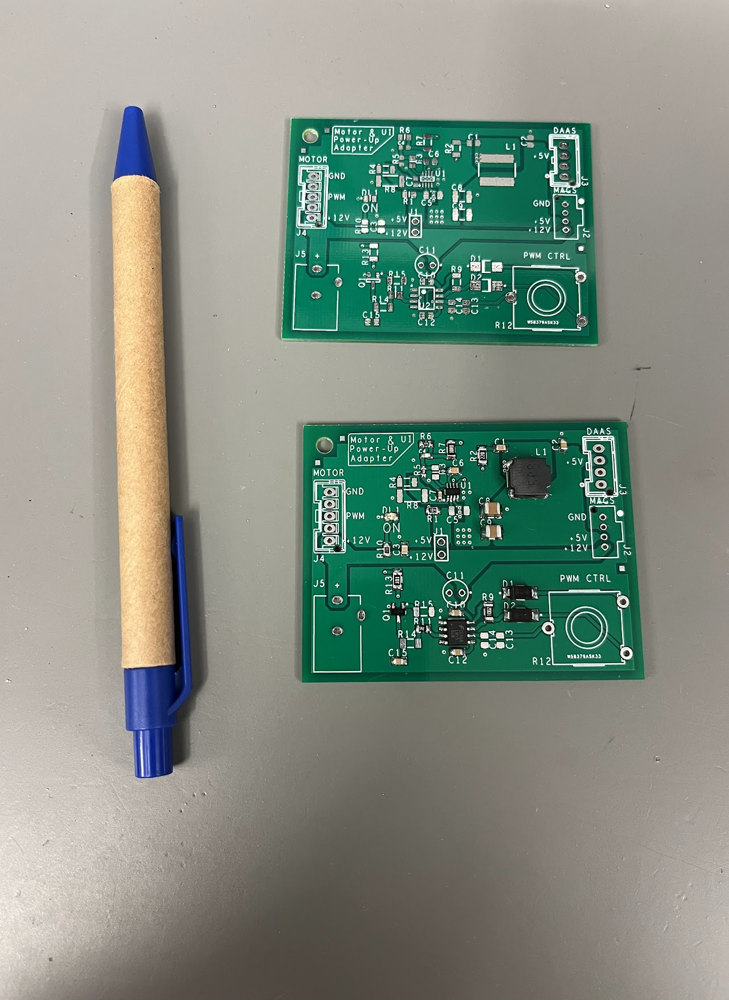

## DC Motor Controller and Test Adapter Board

By Andrew O'Rourke 

This device was created by Andrew O'Rourke during one of his Clemson Co-Op rotations at Electrolux. This double-sided printed circuit board uses various surface-mounted and through-hole components to make a 12VDC motor controller circuit with PWM speed control capabilities as well as a 12VDC to 5VDC step-down circuit to serve as a power supply for various different LED and user interface boards.

The schematic for this board was designed using Cadence's OrCAD Capture CIS 17.4 software, and the printed circuit board was designed using OrCAD PCB Editor 17.4. These tools allowed Andrew to design a completely custom circuit from the ground up, and allowed him to design every aspect of his printed circuit board. The PCB Editor tool was extremely helpful, as it allowed the student to place parts, route traces, and design every other aspect of his printed circuit to prepare it for manufacturing. The design was later sent to a board manufacturer to get printed and was then populated with all of its surface-mount and through-hole components.

