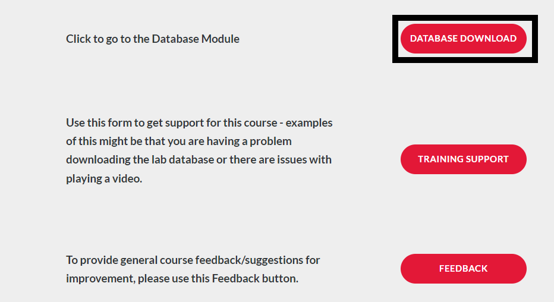
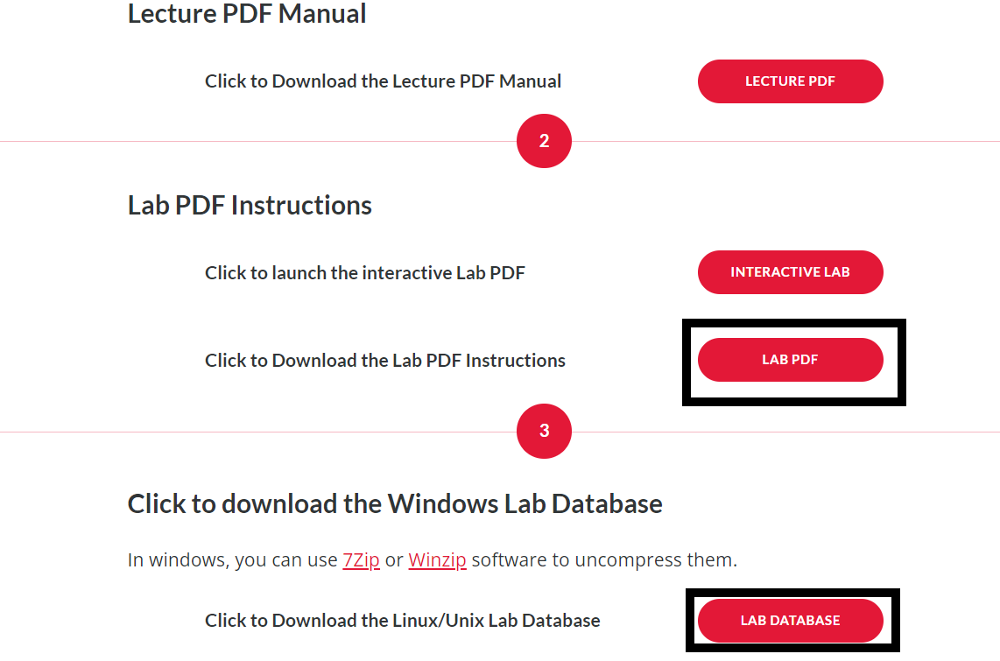
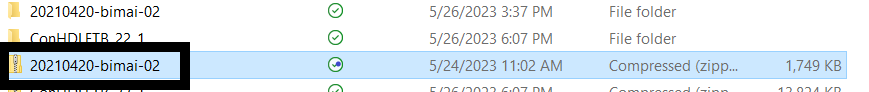
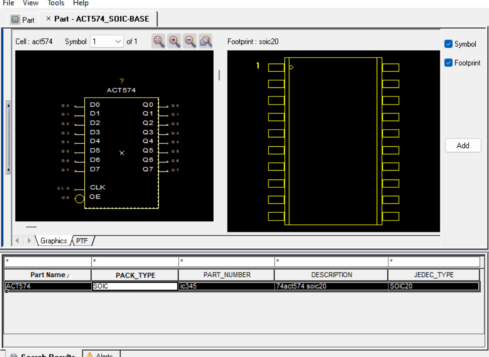

# General Notes

* Here is the [link](https://www.cadence.com/en_US/home/training/all-courses/85053.html) to the course.

* Follow the same steps as above for starting this project; however, **DO NOT** download the lab database into OneDrive (or any form of online storage), as this caused problems down the line for me archiving the project, etc. 

* I actually enrolled in the 22.1 version of the course but used the 17.4 version of the software, and I did not encounter any issues. Currently, we are using the 17.4 version of the software due to the 22.1 version not being fully licensed for Clemson students yet. 

* Some of the modules in this course are the same as the previous one, so you do the same thing two times. I used this as an advantage to practice my skills again and better learn how the software works. 

*When the lab PDF tells you to save the project, and an error comes up when you do this, first check if the lab PDF says anything about errors coming up. If it does, you are good to move on. If it does not, click on the error to see if you can fix it before moving on.

# Requirements

* Access to the Project Manager 17.4 Application

* Access to the PCB Editor 17.4 Application

# Introduction

This course builds on the schematic design entry concepts touched on in the Design Entry HDL Front-to-Back Flow course and introduces the Library Manager. Using the Library Manager allows users to create new parts to be used in a schematic as well as handle and explore libraries for a project. The modules for this course are very short, but it is still important to be thorough when going through the course as part development is integral to the design process. This course can be completed in its entirety using either the 17.4 or 22.1 software.

## Module 1 and Database Downloads

Module 1 of the course simply contains an overview of what the course will cover. It is still important to read over this and gather an understanding of what you will be learning. Before starting the course you should head to the Database Downloads module of the course. On the Module 1 page, click "Database Downloads" and save the folder "Lab Database" to a location on your computer. I recommend making this folder easy to access as you will be navigating to it a lot throughout the course. Right-click on this folder, and click "Extract all". Also, open up the "Lab PDF" in a new tab. See below.

## Module 2: Using Project Manager Design Flows

Serving as an introductory section, module 2 covers how to operate the project manager. First this module re-covers the Board Design flow and how to launch the Design Entry HDL application. For this part of the lab you will want to use the **Allegro Venture PCB Designer Suite** product if using the 22.1 software, or the **Allegro Venture System Design Authoring** product if using the 17.4 software. The second lab will cover something new: the library design flow. Before opening or creating a new project make sure the project manager product is set to **Allegro Library Authoring (PCB Librarian)** if using the 22.1 software or **Allegro PCB Librarian XL** for the 17.4 software.

## Module 3: Setting Up a Library Project

Module 3 covers the setup process for a new library project as well as the part developer. To perform these tasks you will need to be using one of the library authoring or librarian products mentioned in the module 2 section, depending on which software edition you are using.

## Module 4: The Symbol View

This module is incredibly important as it covers the symbol view of a new schematic symbol. The lab will cover the creation of the symbol view, which involves editing the pins, pin placement, labeling, etc. of the schematic symbol. This will also cover some basics of using the part developer, the application used to create new schematic symbols.

## Module 5: The Chips View

Similar to module 4, this module is incredibly important as it ties into the part creation process. This time the lab will cover pin mapping and package definition. This step is integral if you plan on bringing your schematic over to the PCB Editor as your part will need a PCB Footprint (package definition) and will need to have pins correlating to the I/O of the package. For more information on IC packages refer to the resources entry of this guide section.

## Module 6: The Part Table View

The final step in the part creation process, this module covers assigning properties to your new part. The lab also covers the final necessary information relating to the Part Developer basics.

## Module 7: Testing the Part

For the second lab in this module you will need to have access to the PCB Editor software. Either the 22.1 or 17.4 software should work for this so it is up to your discretion which to choose. If the PCB Editor prompts you to select a product, make sure you select the **Allegro PCB Venture** option. The lab does a good job of walking you through what is needed to complete the task at hand in the PCB Editor, but for more information on operating the PCB Editor application, refer to the **OrCAD Crash Courses** section of this guide page.

## Module 8: More Part Building

The final module covering the use of the Part Developer tool, module 8 covers some semantics of the tool's use such as copying parts and opening multiple parts. Module 8 also covers split and asymmetric parts and how they are handled or created in the Part Developer.

## Module 9: Setting Up a Design Project

Module 9 dives back into using the Design Entry HDL application. This means you will need to switch back to the **Allegro Venture PCB Designer Suite** product if using the 22.1 software, or the **Allegro Venture System Design Authoring** product on the 17.4 software.

## Module 10: Design Entry and Packaging

The labs for this module cover some design entry and creation. This is somewhat redundant as nearly all this material was covered in the Allegro Design Entry Using OrCAD Capture course, however, I would highly recommend still thoroughly following along with the lab as it is good review and practice. This module's lab is also taught using the standard mode, as opposed to the windowed mode covered in the previous course. Remember always to choose a **PACK_TYPE** (as seen below choosing the SOIC option) option or **VALUE** option (for a discrete component) when adding parts, even when there is just one option. Failure to make a selection for one of these categories will prompt an error when trying to save the project.

## Module 11: Engineering Changes

Once again somewhat redundant, this module covers basic information such as copying projects, editing copied projects as well as repackaging. Yet again, this is a great opportunity to practice skills learned in earlier courses.