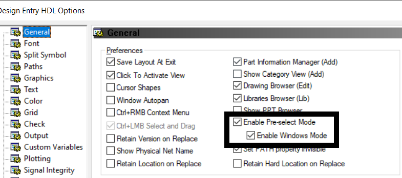

---
title: Allegro Design Entry HDL Front-to-Back Flow
description: Guide for Allegro Design Entry HDL Front-to-Back Flow 
--- 

# General Notes

* Follow the same steps as above for starting this project; however, **DO NOT** download the lab database into OneDrive (or any form of online storage), as this caused problems down the line for me archiving the project, etc. 

* I actually enrolled in the 22.1 version of the course but used the 17.4 version of the software, and I did not encounter any issues. Currently, we are using the 17.4 version of the software due to the 22.1 version not being fully licensed for Clemson students yet. 

* Some of the modules in these courses were the same, so you do the same thing two times. I used this as an advantage to practice my skills again and better learn how the software works. 

* When the lab PDF tells you to save the project, and an error comes up when you do this, first check if the lab PDF says anything about errors coming up. If it does, you are good to move on. If it does not, click on the error to see if you can fix it before moving on.

# Requirements

* Access to the Project Manager Application v17.4

* Access to the Allegro PCB Editor Application v17.4

* Make sure you are using the 17.4 version and not the 22.1 version of the software.

# Introduction

This course introduces users to a different application using for creating schematics: the Design Entry HDL application. Similarly to the Capture CIS application, this software can be used to create schematics. The unique aspect about the Project Manager is that it can be used to launch both the schematic editor (Design Entry HDL) and the PCB Editor containing the PCB layout for the schematic.

## Module 1 and Database Downloads

Module 1 of the course simply contains an overview of what the course will cover. It is still important to read over this and gather an understanding of what you will be learning. Before starting the course you should head to the **Database Downloads** module of the course. On the Module 1 page, click "Database Downloads" and save the folder "Lab Database" to a location on your computer. I recommend making this folder easy to access as you will be navigating to it a lot throughout the course. Right-click on this folder, and click "Extract all". Also, open up the "Lab PDF" in a new tab. See below.

## Module 2: Getting Started With Design Entry HDL

The first learning module of this course covers the basics of operating the Design Entry HDL application. When first launching the **Project Manager** application, it will prompt you to select a product to use. Select the **Allegro Venture PCB Designer Suite** product, as seen in the image to the right. The lab for module two will also have you launch the **PCB Editor** application. If you have yet to launch and configure this software then it too will prompt you to select a product. For this choice select the **Allegro Venture PCB Designer Suite** option, once again as seen in the photos to the right. Be sure to check the **Use As Default** box, this way the program will not prompt you to choose a product each time it is launched. 

## Module 3: Project Setup

This section covers the basic creation and setup of a Design Entry HDL project. The lab is fairly straightforward, however in step 5 of the "setting up a project" section, the lab mentions specifying the path to where the project will be stored. The lab says to simply add "\ram" to the end of the file path, which should be done, but first I would recommend going and creating the ram folder within the ftb folder in your file manager. Some computers may not automatically create the folder when a path which points to a file that does not exist is entered, and will prompt an error instead.

## Module 4: Design Entry and Packaging

Module 4 covers part placement as well as other topics such as packaging, page management, and changing modes in the Design Entry HDL application. Each section of this module is very important as processes such as packaging are integral, especially when you start carrying the design over to the PCB Editor. Once again the lab does a great job walking through the material, however one issue that I encountered was that the application would get stuck while packaging at times during the back-annotation step. If it does this, simply restart the computer, re-open the schematic and run the packager again. Another important note is the material in lab 4-9. This lab covers switching to Windows Mode in the Design Entry HDL software. It is very important to keep the application in windows mode for the remainder of the lab as the rest of the lab manual is written assuming the user is still in windows mode. To ensure you are in windows mode, click tools, options, and under the General tab, ensure "Enable Pre-select Mode" and "Enable Windows Mode" are selected, as seen below.

## Module 5: Hierarchical and Team Design

This module covers hierarchical design, a little bit of schematic entry and design, net listing, and creating a BOM. Since module 5 will have you creating some more schematics, it is very important to have the reference schematic pdf open to follow along. This is the schematic the lab wants you to create. This pdf can be found within the pdf folder in the ftb folder.

## Module 6: Design Rules

Module 6 covers the constraint manager and all the different property tables which it contains. The lab is very straightforward for this section, but it is very important to pay thorough attention to the lecture section in order to understand what each constraint manager page is used for and what properties they can control.

## Module 7: Rules-Driven Layout

Since this section finally covers carrying the design over from Design Entry HDL to the PCB Editor, it is important to ensure you have the PCB Editor application up and running. Lab 7-3 will have you run the auto-router in PCB Editor. This function automatically creates the connections between components on the PCB. If you are using the v22.1 PCB Editor, the auto-router will not work. To get around this, run the auto-router on the PCB Editor 17.4 application.

## Module 8: Engineering Changes

The final learning module for this course, this section covers some design synchronization between Design Entry HDL and the PCB Editor. This will allow you to make changes in one program and update the other program. The module will also cover some basic project management, such as copying projects.