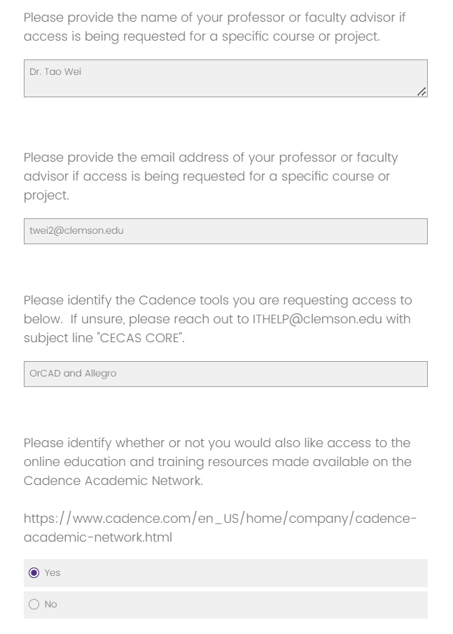
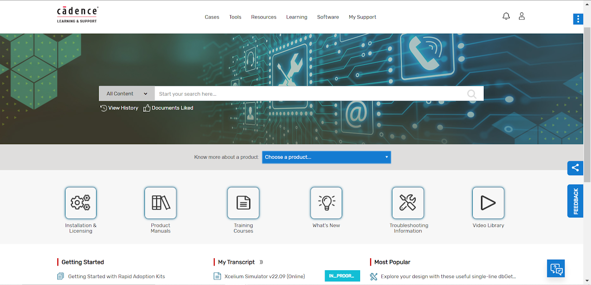
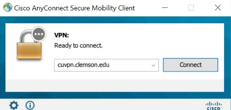
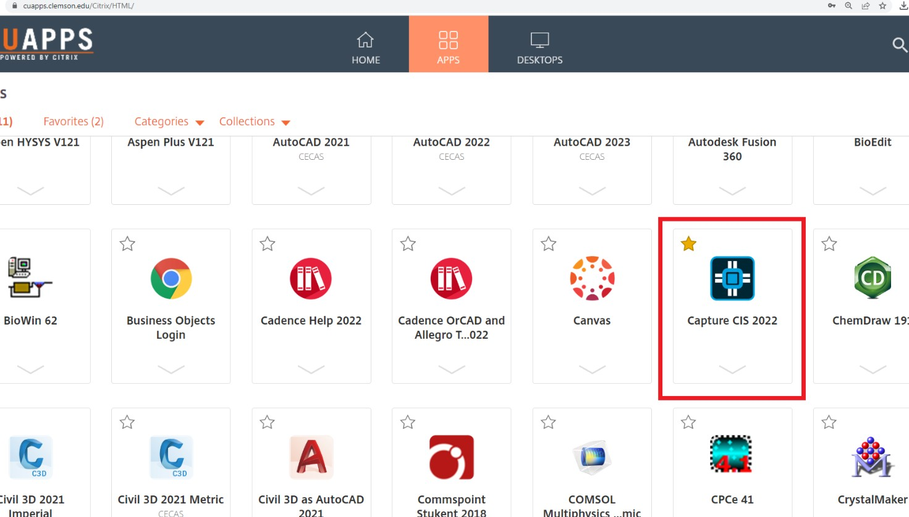
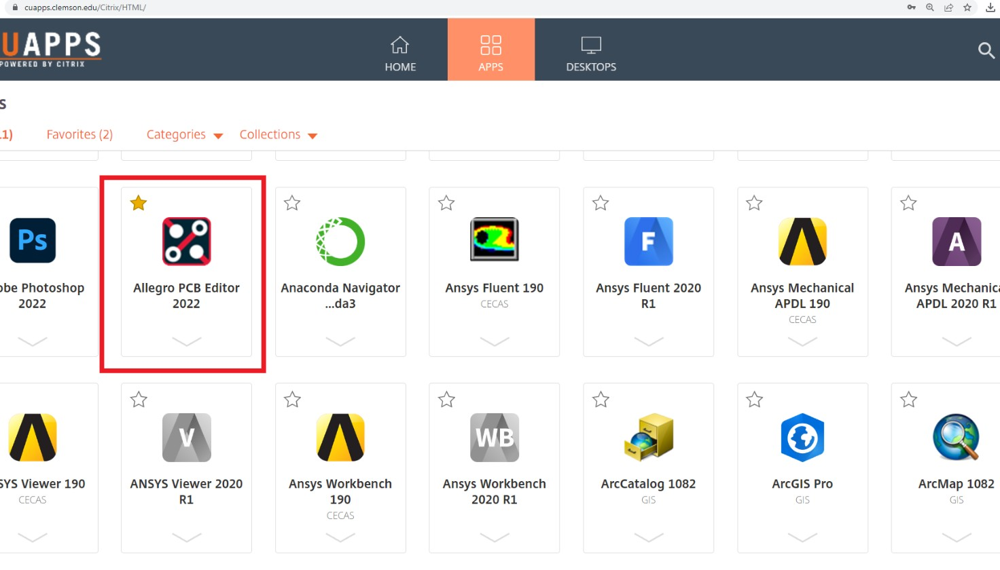
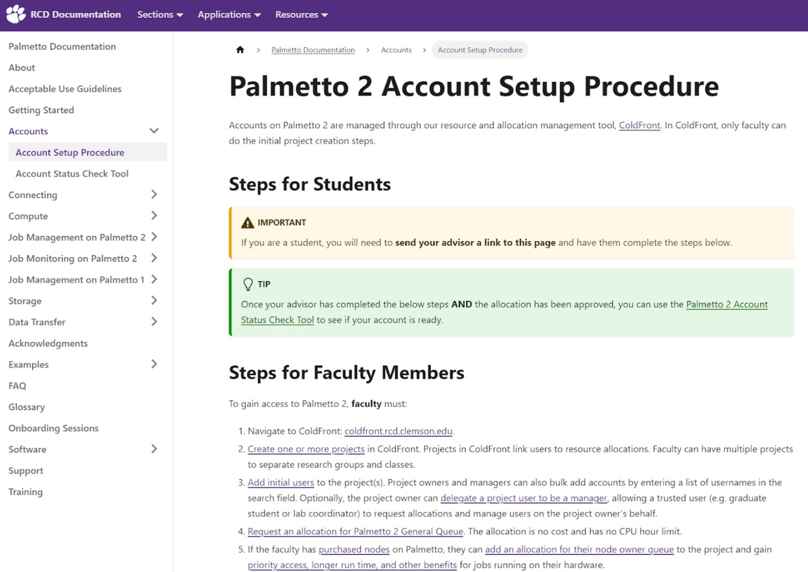
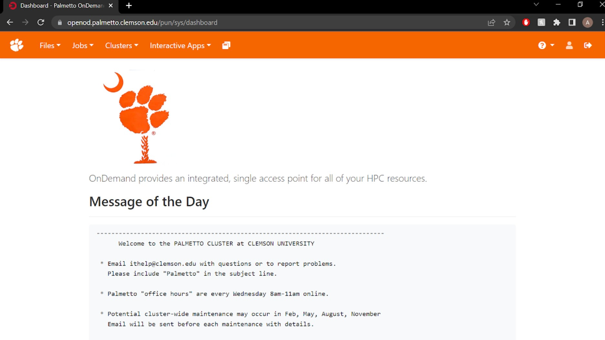
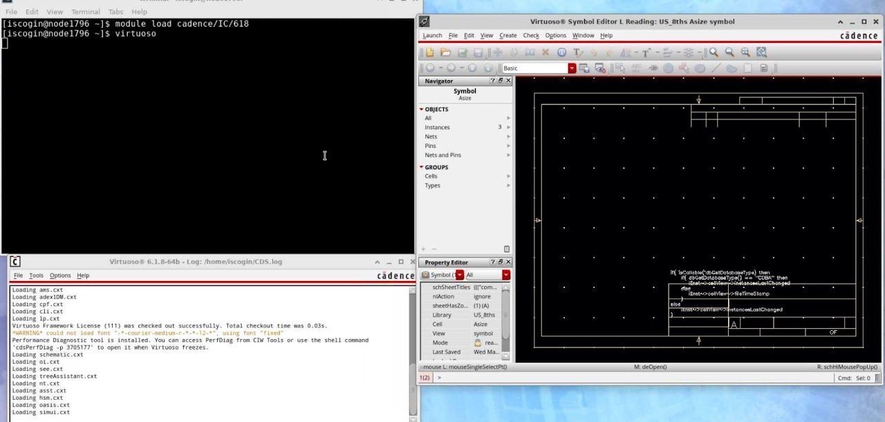
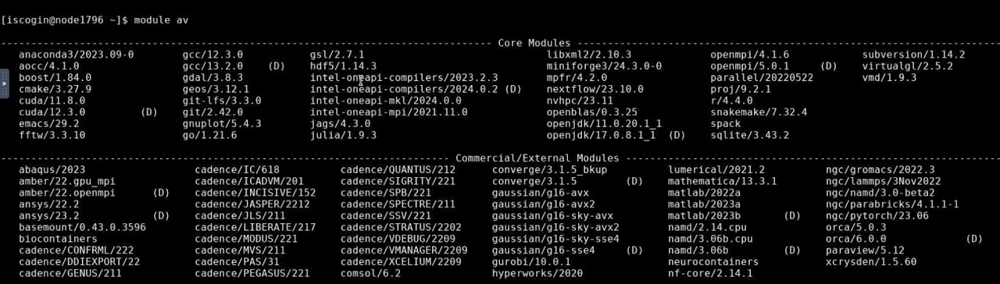

This page will walk you through all the steps necessary to access Cadence's software in whichever way works best for you. It'll guide you step-by-step through creating the necessary accounts, downloading the right software, accessing software remotely, and getting access to training courses on Cadence's Academic Network.

## Cadence Academic Network

### Creating an Account
To start, you'll want to go to the [CCIT page for Cadence](https://ccit.clemson.edu/services/software-hardware/software/cadence/). Here, complete the form linked under **"Request a Cadence License"**. This will begin the process for CCIT to work with Cadence in creating you an account with access to the software downloads and training courses that's needed to work with the Cadence software.

Since the Cadence University Program partnership was rolled out to Clemson at the beginning of the Spring 2023 semester, it's possible that an account has already been created for your username, or that you created one yourself when emails were initially sent out regarding the partnership in January of 2023. It may be beneficial to attempt to login to the [Cadence Support](https://support.cadence.com/apex/homePage) site or create an account there using your Clemson email address before requesting access on the CCIT page.

On the request form, put Dr. Tao Wei's name and contact in as the information for faculty advisior. Additionally, make sure to specify the OrCAD and Allegro software, and to check the box to request access to the online education and training resources.

It may take up to two weeks for the request to be processed, but we'll try to make sure that you get a response within a day or two.

Once your account has been set up, you'll receive an email from someone at Cadence informing you that the signup process has been started and informing you of your login email address (which will be your Clemson email address). Additionally, you'll get an automated email from Cadence letting you know that your account has been registered. This email will provide you with a temporary password for your account. Please login with your Clemson email and this password immediately and change your password to something new. **Should you not receive the expected response within one week of submitting the form, please feel free to contact [CCIT](https://ccit.clemson.edu/services/software-hardware/software/cadence/) for assistance.**

Now, you should be able to login and access the Cadence Support home page. This is the site that we'll be using to access the software downloads and the training courses.

### Training Courses

The first step towards gaining training experience with Cadence's tools is figuring out what your goals are and what kind of tools you'd actually like to work with. Take a look at Cadence's [Learning Maps](https://www.cadence.com/content/dam/cadence-www/global/en_US/documents/training/learning-maps.pdf) to get an idea of what paths are available for you to explore. More detailed recommendations for given interest areas are available on the [Training Courses](/start/training) tab.

## Software Access

For locally installed software, please note the minimum and recommended system requirements. For the best experience, make sure that you're installing the software onto a Windows 10 or 11 operating system, and that your machine has at least an i7 or Ryzen 7 processor with at least 4 cores, 16GB of RAM or more, a dedicated graphics processor, and 50GB of free disk space (~500GB on an SSD is recommended and will greatly speed up your installation process, but this is not a requirement and most locally-installed software runs fine on a decent laptop).

### Cisco AnyConnect

The first software you'll want to install is the Cisco AnyConnect VPN. This will allow you to remotely log on to the Clemson network, which is necessary to access the license server for Cadence software when you're not physically on campus. The installation for this software is located on the [CCIT page](https://ccit.clemson.edu/services/network-phones-cable/network/vpn/). The link provided on the CCIT page will redirect you to the Clemson CUVPN site. You'll need to log in with your Clemson credentials and complete a two-factor authentication. Upon login, you should see the following page.

Expand the **"Instructions"** section to view all the steps for installing the VPN, then hit **"Download for Windows"** and begin the installation process. Once the software is done installing, launch the Cisco AnyConnect app. You'll want to connect to **"cuvpn.clemson.edu"**. You'll be prompted to log in - use your Clemson username, password, and then type **"push"** in the third field in order to get the two-factor authentication sent to your Duo app.

Now, you should be connected to the Clemson network! You'll have to launch the VPN and connect whenever you want to launch Cadence software on your machine from home, as connection to the Clemson network is necessary to access the Cadence licensing server that's set up on Clemson campus.

### OrCAD and Allegro

**Update:** It should be noted that a few of the main training modules have been bumped up to the newer "OrCAD X" versions of the software. While we cannot confirm that every application will be compatible with our license server, OrCAD X v23.1 has yet to present any major problems. Capture CIS in OrCAD X v24.1 has not been compatible with our license, so stick to the 2023 version if you need to use a newer release for any reason. 

OrCAD Capture is used to create schematics and design parts and circuit elements, and Allegro PCB Editor takes this information and allows you to design your own printed circuit boards for manufacturing.

To download this software, you'll need to go log onto the [Cadence Support home page](https://support.cadence.com/apex/homePage), then navigate to **Software > Download Software** in order to get to their [software downloads page](https://downloads.cadence.com/ESDWeb/Welcome.eo). In the search bar, search "OrCAD". We're going to click on the OrCAD X/Allegro X 23.1 (SPB231) release - the most recent software release for OrCAD/Allegro supported by our academic license. At this point, you'll have two different options for installation. You could install the download manager and download the software from there, or you could download the .zip files for the software and the hotfix. We're going to go with the first option, since it's much more straight-forward and user-friendly.

Once downloaded, go to your downloads folder and right-click on the executable for the download manager. Select **"Run as Administrator"** and then select **"Yes"** when the pop-up asks if you'd like to allow the software to make changes to your device. When the installer runs, select **"Agree"**, then hit **"Next"**. On the second screen, select the file path for the installation of the download manager - I just chose the default. Hit "Next". Lastly, check the boxes to create a shortcut (if you'd like) and to run the application once it's finished installing. Hit **"Finish"**.

The download manager should install pretty quickly - usually in under a minute. Once the download manager finishes installing, it'll run automatically. Once in the app, scroll down to the "OrCAD and Allegro" option. Make sure that it's set to the 22.1 installation (or 23.1 for the newer OrCAD X Suite - which many of the training modules have been updated to).

Before you hit "Install", please note that this installation takes a long time. The download manager app has to download about 13GB of compressed zip files from Cadence, unpack these, then install. Make sure that you can leave your computer on/charging for this amount of time and that you have a fast, stable internet connect. When you're ready, hit **"Install"**.

For more information on which pieces of Cadence software are supported by our academic license, see the respective section in [Training Courses](/start/training).

It should take 10-15 minutes for the download manager to download all of the installation files from Cadence's website. After it has downloaded everything it needs, it'll prompt you to either install now, or install later. This is your chance to make sure you're going to have enough time to leave your computer idle while the installation occurs.

If you're ready to start installing, click "Install Now". This will begin the installation process of the OrCAD and Allegro software, and it should open up the installation wizard for the software. On the first page on the installation wizard, select "I Accept", then click "Next". On the second page, make sure to select  "Anyone who uses this computer (all users)", and check the boxes to install both the OrCAD Products and Allegro Products. You can also specify your installation path for the software here. I just left it on it's default settings, which puts it in a Cadence folder on my main drive. Click "Next". 

This last screen is the most important, since messing up the license file settings will prevent you from accessing any and all of the software you're installing. The license server we're using as **"license8.clemson.edu" located at port 28070.** It is **VERY IMPORTANT** that these are copied exactly. Select **"Connect to an Existing License Server"**, and put this information into the fields below. When you're done, hit "Install". It'll now begin installing the OrCAD and Allegro softwares, which may take anywhere between 40 minutes to 2 hours, depending on the type of hard drive or SSD you have on your computer. 

Note that when installing, there won't be a progress bar in the download manager software, but there should be a few icons for the download manager that appear on your desktop toolbar. You won't be able to open these into an application window, but DO NOT close these processes, as they're what's installing the software. One of them should have a green progress bar on the icon so that you can track the installation process.

Once the software finishes installing, you should be all set! Hit the windows key and search "Capture CIS" and "Allegro" to make sure everything is installed. It should look something like the following:

When you're ready, you can go ahead and launch your new software. Remember: you must be connected to the CUVPN or on the Clemson campus network to be able to use this software. Otherwise, you'll get an error saying that the license file was not found or couldn't be accessed. Additionally, the first time you run OrCAD or Allegro, it'll prompt you to select a product. For **Capture CIS**, select the **"Allegro PCB Design CIS L**" option, and for **Allegro PCB Editor**, select the **"Allegro PCB Venture"** option and check the box for **"Use as default"**. If you have a need to, you can always change to a different product by going to **File > Change Product...** within either of the applications. If neither of these appear, just use the first option.

After you've verified your installations, you're all set to start using the Capture and PCB Editor software. I highly recommend going to the [Training Courses](/start/training) section of this page and signing up for a few of the introductory courses for OrCAD Capture and Allegro PCB so that you can learn some basic skills, get a feel for using the applications, and start collecting some badges!

### Remote Access using CUApps

If you're not sure that your computer meets the specifications for Cadence's software or if you don't want to have to install the apps onto your harddrive, you can also access Cadence's OrCAD/Allegro Capture and PCB Editor softwares remotely using [CUapps](https://ccit.clemson.edu/cuapps/). CUapps gives you a virtual connection to the software running off of one of Clemson's computers, making it so that your own computer doesn't have to have the software installed or running. Be aware, however, that using the software may be a bit slower while using CUapps due to latency in the connection between your machine and Clemson's machine.

To use CUapps, you can either download the Citrix Workspace desktop application by following the linked CCIT instructions, or you can [access CUapps online](https://cuapps.clemson.edu/Citrix/HTML/) in your web browser. While in CUapps, click the "Apps" icon at the top of the window and then scroll down to find the app you wish to use. From the Cadence suite, you'll have access to Capture CIS 2022, which is used primarily for schematic and circuit design, Allegro PCB Editor, which is used for printed circuit board design, as well as the Cadence Help 2022 and the Cadence OrCAD and Allegro Tutorials 2022 which can be used for troubleshooting and basic help using the apps.

### Using the Palmetto Cluster
Some Cadence software such as Virtuoso and Innovus are Linux-based applications. Clemson has installed this software onto the Palmetto Cluster high-powered computing machine so that they can be accessed remotely and can utilize the full power of this HPC machine. To use these applications, you'll have to setup an account for the Palmetto Cluster. If you'd like, you can read more about what the Palmetto Cluster is [here](https://www.clemson.edu/ccit/research/about/).

#### Account Setup
As of Fall 2024, the procedure for gaining access to the Palmetto Cluster has been revised. Individual students are **no longer able to request access** to cluster allocations, and must be added by a **faculty sponsor**. For the time being, if you wish to access the Palmetto Cluster then please contact your faculty advisor or Dr. Tao Wei (**twei2@clemson.edu**) with regards to sponsorship. If you are accessing Linux-based tools for a course, check with your teacher to see if you are given access for the course. For more information, see [this website](https://docs.rcd.clemson.edu/palmetto/accounts/setup/).

It typically takes some time processed, so you won't have access to Palmetto right away after submitting the form. Continue to check your email frequently for confirmation and updates, and I recommend attempting to access the [Palmetto OnDemand](https://ondemand.rcd.clemson.edu/pun/sys/dashboard/) page to see if your account has been set up, as sometimes your account might be given access before you get a confirmation email. Note that since the Palmetto Cluster machine isn't set up on Clemson's campus network, you'll have to complete a Duo authentication whenever you want to access it - even if you're on the CUVPN or Clemson campus network. More comprehensive information on getting started with the Palmetto Cluster is located on their [documentation site](https://docs.rcd.clemson.edu/palmetto/starting/). 

#### Using Palmetto

For most uses, the Palmetto cluster is accessed with a command line interface or different programming IDEs, but we need a graphical interface so that we can run our specific Cadence applications. There are a couple ways to do this, but we're going to focus on the method using the Palmetto Desktop, since it's the most accessible and easiest to use and configure. To get some more in-depth information about the different ways to access graphical software on Palmetto, you can read the documentation here.

To use the Palmetto Desktop, all you have to do is go to the Palmetto OnDemand site, click "Interactive Apps", and select the "Palmetto Desktop" option. For more information on Palmetto OnDemand, you can read the documentation here. More in-depth information on the Palmetto Desktop is also located on the Palmetto Documentation site here.

Configure the Palmetto Desktop using all the defaults, but make sure to change "Number of Hours" to the amount of time that you anticipate to be using the application for during this particular session.

#### Accessing Cadence Applications
Once you're in the Palmetto Desktop, open up a terminal. From here, you can type **"module load cadence/[software name]/[version]"** to load in the required software. To view the available modules, enter **"module av"** into the command prompt. Once loaded, the software can be launched by entering the appropriate software command into the terminal (be that "stratus", "virtuoso", 
innovus", etc...). Additional commands can be viewed with **"module"**.

To give a specific example, the Virtuoso software (a popular option for custom chip design) is loaded using **"module load cadence/IC/618"**, and then launched with **"virtuoso &"**.

Many of the training modules for the Linux-based software contain default definitions to library paths which do not exist. This is due to the setup of the Palmetto Cluster, and can be fixed by redefining your library paths on a local level to the location of the Cadence folder: **"/software/commercial/cadence/"**.

For more information, check out Cadence's training courses on the Virtuoso, Genus, Innovus, Xcelium, Sigrity, and Stratus software for the Linux operating system.